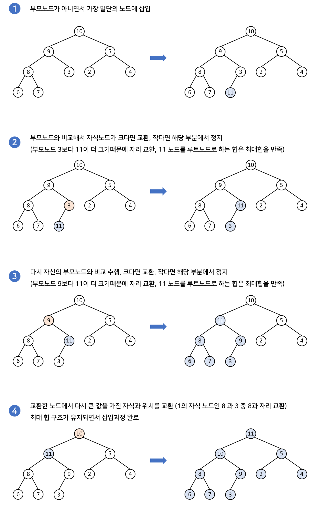

# Heap(힙)

## Heap이란?
힙은 **최댓값** 및 **최솟값**을 찾아내는 연산을 **빠르게** 하기 위해 고안된 **완전이진트리**를 기본으로 한 자료구조로서 다음과 같은 힙 속성을 만족합니다. (완전이진트리는 마지막 리프 노드를 제외한 모든 노드에서 자식들이 완전히 채워진 트리를 말합니다.)
* A가 B의 부모노드(parent node)이면, A의 키(key) 값과 B의 키값 사이에는 대소 관계가 성립한다.
  * 키값 대소관계는 오로지 **부모와 자식 간에만 성립**되며 **형제사이에는 대소 관계가 성립되지 않음**.

**최소/최댓값의 확인 및 삭제가 필요할 때** Heap을 사용하면 수행 속도가 빠르고 좋습니다.

## Heap의 종류

### 1. 최대 힙(Max Heap)

* 부모노드의 키 값이 자식노드의 키값보다 항상 큰 힙

* Key(부모노드) >= Key(자식노드)

* 가장 큰 값이 루트노드에 있음

### 2. 최소 힙(Min Heap)

* 부모노드의 키 값이 자식노드의 키값보다 항상 작은 힙

* Key(부모노드) <= Key(자식노드)

* 가장 작은 값이 루트노드에 있음

## 힙의 구현
힙은 일반적으로 **배열**로 표현합니다. 물론 연결리스트로도 구현이 가능하지만, 문제는 특정 노드의 '검색', '이동'과정이 조금 더 번거롭기 때문입니다.

구현을 쉽게 하기 위해 배열 인덱스 1부터 사용하는데요, 고유 번호(인덱스)를 통해 부모/자식노드를 구할때 아래와 같은 규칙이 있습니다.

### 힙에서의 부모 노드와 자식 노드의 관계
* 왼쪽 자식의 인덱스 = (부모노드의 인덱스) * 2
* 오른쪽 자식의 인덱스 = (부모노드의 인덱스) * 2 + 1
* 부모의 인덱스 = (자식노드의 인덱스) / 2

## 삽입, 삭제로 깨진 힙을 재구조화(heapify)
힙에서 삽입, 삭제가 일어나게 되면 경우에 따라 최대 힙, 최소 엉덩이의 조건이 깨질 수 있습니다. 

이러한 경우 해당 조건을 만족할 수 있게 노드들의 위치를 바꿔가며 힙을 재구조화(heapify)하는 과정이 필요합니다. 

보통 힙에서 삽입과 삭제의 경우 연산 자체는 `O(1)`로 동작하지만, 재구조화(heapify)의 과정을 거치기 때문에 `O(logn)`의 시간복잡도를 가지게 됩니다.

Max heap에서 heapify의 작업은 다음과 같습니다.

1. 요소 값과 자식 노드 값을 비교합니다.
2. 만약 자식 노드 값이 크다면 왼쪽 오른쪽 자식 중 가장 큰 값으로 교환합니다.
3. 힙 속성이 유지될 때까지 1,2번 과정을 반복합니다.

다음 그림은 값이 8인 노드에 대해 최대 힙 heapify를 수행하는 예입니다.

Step 1. 첫 번째 노드 값(8)이 자식보다 작으므로 자식 중 가장 큰 오른쪽 자식 값(20)과 교환합니다.

Step 2. 값이 8인 노드에서 heapify를 다시 시작합니다. 8이 왼쪽 자식 노드 13보다 작기 때문에 교환합니다.

이제 8이 leaf node이므로 heapify를 추가로 호출해도 힙 구조에 영향을 주지 않습니다.

## 힙(heap)의 삽입

힙의 삽입과정은 다음과 같습니다.

1. 힙의 마지막 노드에 새로운 노드를 삽입한다. `시간복잡도 O(1)` 
2. 이후 부모 노드와 비교하면서 재구조화(heapify) 과정을 수행합니다. `시간복잡도 O(log N)`

즉, 삽입과정은 아래에서 위로 재구조화 과정이 이루어지게 되는것 입니다. 힙에서의 삽입 과정의 시간복잡도는 `O(log N)`이 됩니다.

아래의 예시는 최대 힙에 값 11을 갖는 노드를 삽입하고 재구조화하는 과정입니다.

## 힙(heap)의 삭제

힙의 삭제 과정은 다음과 같습니다.

1. 루트노드를 삭제합니다. `시간복잡도 O(1)` 
2. 가장 마지막 말단 노드를 루트노드 자리에 대체합니다.
3. 이후 재구조화 과정을 수행합니다. `시간복잡도 O(log N)`

즉, 삭제 과정은 위에서 아래로 재구조화 과정이 이루어지게 됩니다. 힙에서의 삭제 과정의 시간복잡도는 `O(log N)`이 됩니다.

아래의 예시는 최대 힙에서 루트노드를 삭제한 후 재구조화하는 과정을 나타냅니다. 

## 힙(heap)의 조회

최대 힙에서 최대 값인 루트 노트의 값을 조회할 경우 시간복잡도는 `O(1)`, 
최소 힙에서 최소 값인 루트 노트의 값을 조회할 경우 시간복잡도는 `O(1)`  입니다.

## heap과 Priority Queue(우선순위 큐)
우선순위 큐는 가장 우선순위가 높은 데이터를 먼저 꺼내기 위해 고안된 자료구조입니다. 

우선순위 큐는 보통 heap과 같이 거론되곤 하는데요. 이는 우선순위 큐가 주로 힙 자료구조를 사용해 구현되기 때문입니다. (배열, 연결리스트로 구현할 수 도 있지만 시간복잡도 측면에서 힙이 더 낫기 때문)

## heap과 BST의 차이점
### heap
* Heap에서는 상위 level에 존재하는 값이 하위 level에 존재하는 값보다 우선순위가 높다.
* 하지만 좌/우에서의 우선순위는 절대적이지 않다.
* 왼쪽의 값이 우선순위가 높을 수도, 오른쪽의 값이 우선순위가 높을 수도 있다.
* Heap에서는 root가 가장 우선순위가 높기 때문에 가장 작은 값을 추출하거나 가장 큰 값을 추출해야 하는 경우 사용한다.

### BST(Binary Search Tree)
* BST에서는 왼쪽의 값이 오른쪽의 값보다 작다.
* 하지만 상/하에서의 값은 절대적이지 않다.
* 상위 level에 존재하는 값이 하위 level에 존재하는 값보다 클 수도, 작을 수도 있다.
* BST는 (평균적으로) 탐색이 O(log n), 삽입/삭제가 O(log n)에 가능하기 때문에 탐색이 빈번하게 일어나는 경우 사용한다.

## 예상 질문

* Heap은 기본적으로 어떤 자료구조를 사용하나요?

* Heap의 삭제, 삽입의 원리와 시간복잡도는?

* 우선순위 큐(Priority Queue)의 동작 원리가 어떻게 되나요? 

* Heap과 BST의 차이점이 무엇인가요?