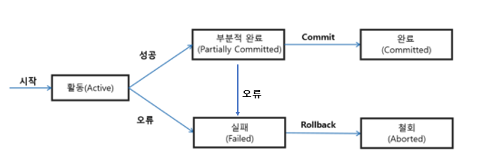

# 트랜잭션

# 트랜잭션이란

- 작업의 완전성을 보장해주는 단위
- 논리적인 작업 셋을 완벽하게 처리하거나 처리하지 못할 경우 원상태로 복구가 가능해야 함
- 사용자 입장 → 작업의 논리적 단위
- 시스템 입장 → 데이터를 접근/변경하는 프로그램의 단위

# 트랜잭션의 특성(ACID)

## 원자성(Atomicity)

> 트랜잭션 중간에 어떠한 문제가 발생한다면 어떠한 작업 내용도 수행되서는 안되며 
아무런 문제가 발생하지 않은 경우에만 모든 작업이 수행되어야 한다.
> 

<aside>
💡 트랜잭션이 DB에 모두 반영되거나, 전혀 반영되지 않거나 둘 중 하나여야 한다.

</aside>

## 일관성(Consistency)

> 트랜잭션이 완료된 다음에도 트랜잭션이 일어나기 전의 상황과 동일하게 
데이터의 일관성을 보장해야 한다.
> 

<aside>
💡 한 데이터베이스 내에서 연관 있는 데이터들이 상이한 내용이 존재하면 안 된다.
동일한 데이터가 여러 파일에 흩어져 있기 마련인데, 시간이 지남에 따라 동일한 데이터가 다른 값을 가지면 안 된다.

</aside>

## 고립성(Isolation)

> 각 트랜잭션은 서로 간섭 없이 독립적으로 수행되어야 한다.
> 

<aside>
💡 하나의 트랜잭션이 다른 트랜잭션에 끼어들 수 없다. 독립적이어야 한다.

</aside>

## 지속성(Durability)

> 트랜잭션이 정상 종료된 다음에는 영구적으로 데이터베이스에 작업의 결과가 저장되어야 한다.
> 

<aside>
💡 Commit을 통해 데이터베이스에 영구적으로 저장된다.

</aside>

# 트랜잭션 상태

트랜잭션의 상태

- 활동(Active) : 트랜잭션이 실행 중인 상태
- 실패(Failed) : 트랜잭션 실행에 오류가 발생하여 중단된 상태
- 철회(Aborted) : 트랜잭션이 비정상적으로 종료되어 롤백 연산을 수행한 상태
- 부분 완료(Partially Committed) : 트랜잭션 마지막 연산까지 실행했지만, 커밋 연산이 실행되기 전 상태
- 완료(Committed) : 트랜잭션이 성공적으로 종료되어 커밋 연산을 실행한 후의 상태

# 트랜잭션 연산

- DB 단위에서 트랜잭션을 사용하기 위해 제공하는 쿼리문으로는 Commit, Rollback이 있다.

## Commit

- 하나의 트랜잭션이 완료되었음을 데이터베이스 관리자에게 알려주기 위한 연산

## Rollback

- 트랜잭션 처리가 비정상적으로 종료되어 데이터베이스의 일관성을 깨트렸을 때, 트랜잭션의 원자성을 제공하기 위해 해당 트랜잭션이 행한 모든 연산을 취소하는 연산
- 해당 트랜잭션을 재시작하거나 폐기한다
- DML에 해당하는 SQL을 취소하기 때문에, DDL에는 효과가 없다

## Savepoint

- 현재의 트랜잭션을 잘게 분할하는 명령어
- Rollback문과 같이 사용하여 특정 위치까지 Rollback할 수 있다
- 여러 SQL을 수반하는 트랜잭션의 경우, 중간 단계에서 Savepoint를 지정할 수 있다

# Database 설정

- MySQL
    - 저장 엔진에 따라 다름
    - MySQL 5.1까지는 MyISAM으로, Transaction 지원 x
    - 이후 버전은 InnoDB로, Transaction 지원
- 자동 Commit
    - `SET AUTOCOMMIT=1` 로 설정 가능, 모든 문장마다 자동으로 COMMIT 실행
    - 디폴트 값이 1이며, 세션마다 새로운 연결 시 자동으로 Autocommit 활성화
    - 이를 종료하기 위해서는 `SET AUTOCOMMIT=0` 을 수행하거나, 접속 시 autocommit을 false로 지정하고 접속하면 됨
    - SQL이 정상 종료된 경우 → 자동 Commit
    - DDL과 DCL이 수행된 경우 → 자동 Commit
- 시스템에서 제공하는 자동 Rollback
    - SQL이 비정상 종료된 경우 → 자동 Rollback
    - 정전이 발생하거나 컴퓨터가 Down되었을 시 → 자동 Rollback
- 수동 Commit
    - 자동 커밋이 설정되어 있는 상태에서, `START TRANSACTION` 명령을 통해 특정 구간에서 일시적인 트랜잭션을 생성할 수 있음
    - `COMMIT` 명령을 마지막으로 트랜잭션이 완료됨

# 트랜잭션 스케줄

## 직렬 스케줄

- 순서대로 하나씩 트랜잭션을 수행
- 하나의 실행이 완료되면 다른 트랜잭션을 시작
- 한 트랜잭션 동안 다른 트랜잭션의 영향을 받지 않으므로 모순이 발생하지 않는다

## 직렬화 스케줄

- 병렬 프로그래밍의 장점을 갖고 있다
- 트랜잭션이 동시에 자료 접근 연산을 교차하며 실행하면서 결과가 직렬 스케줄과 동일
- 적절한 제어를 통해 일관성을 유지하는 스케줄

# 트랜잭션에서의 병행 처리 문제

- 데이터베이스는 트랜잭션이 독립적인 수행을 하도록 한다
- 따라서 Locking을 통해 다른 트랜잭션이 관여하지 못하도록 막아야 한다
- 하지만 무조건 Locking을 수행하면 데이터베이스의 성능이 떨어지게 됨
- 효율적인 Locking 방법이 필요

## Locking 종류

- 공유 Lock
    - 특정 자료에 공유 Lock을 걸면 다른 트랜잭션이 해당 자료를 갱신할 수 없다
    - 다른 트랜잭션이 읽는 것은 가능하다
- 배타 Lock
    - 특정 자료에 배타 Lock을 걸면 다른 트랜잭션이 자료를 갱신할 수 없고, 읽을 수도 없다.
        - 배타 Lock이 걸린 자료는 공유 Lock을 갖고 있는 트랜잭션들에 의해 읽혀질 수 없다
        (Dirty read 방지 - 아래에서 설명)

## 트랜잭션 격리 수준(Isolation Level)

1. Read Uncommitted(level 0)
    - Select 문장이 수행되는 동안 해당 데이터에 Shared Lock이 걸리지 않는다
    - 트랜잭션에 처리중이거나 Commit되지 않은 데이터를 다른 트랜잭션이 읽는 것을 허용
    - 데이터 정합성에 문제가 있어, 사실상 격리수준으로 인정되지 않음(Dirty Read 발생)
2. Read Committed(level 1)
    - Select 문장이 수행되는 동안 해당 데이터에 Shared Lock이 걸린다
    - 트랜잭션이 Commit되어 확정된 데이터만 읽는 것을 허용
    - 일반적인 SQL 서버의 Default Isolation Level
3. Repeatable Read(level 2)
    - 트랜잭션이 시작되기 전에 Commit된 내용에 대해서만 조회가 가능하다
    - 자신의 트랜잭션 번호보다 낮은(먼저 일어난) 트랜잭션 번호에서 커밋된 사항만 확인 가능
    - 트랜잭션이 범위 내에서 조회한 데이터 내용이 항상 동일함을 보장
    - 다른 사용자는 트랜잭션 영역에 해당되는 데이터에 대한 수정 불가
4. Serializable(level 3)
    - 한 트랜잭션을 다른 트랜잭션과 완전히 분리하는 격리 수준
    - 트랜잭션이 완료될 때까지 Select 문장이 사용하는 테이블에 공유 Lock을 건다

## 낮은 단계의 트랜잭션 고립 수준에서 발생하는 문제 사항

1. Dirty Read
    - 아직 실행이 완료되지 않은 다른 트랜잭션에 의한 변경 사항을 보게 되는 상황
    - 커밋되지 않은 데이터를 다른 트랜잭션에서 읽을 수 있도록 허용할 때 발생
    - 예시
        1. T1이 데이터에 접근하여 A→B로 데이터를 변경, 커밋을 하지 않았다
        2. T2가 데이터를 Read한다, B를 확인
        3. T1이 커밋을 하지 않고 Rollback한다
        4. 실제 데이터는 A이지만 T2에서는 B로 읽게 된다
    - 해결 방안
        - Read Committed 격리 수준을 활용하여 커밋되어 확정된 데이터만 읽을 수 있도록 지정한다
2. Non-Repeatable Read
    - 한 트랜잭션에서 같은 쿼리를 두 번 수행할 때 그 사이에 다른 트랜잭션 값을 수정하거나 삭제하면서 두 쿼리의 결과가 다르게 나타나는 상황
    - 예시
        1. T1에서 특정 데이터를 조회, A를 확인
        2. T2에서 A 데이터를 B로 변경
        3. T1에서 데이터를 다시 조회한 결과 B가 조회됨
    - 해결 방안
        - Repeatable Read 격리 수준을 활용하여 이전 트랜잭션이 완료되었을 때의 데이터만 조회할 수 있도록 지정한다
        - Q) 이렇게 진행되면 Phantom Read도 해결되지 않나요? - [ISSUE #15](https://github.com/prgrms-web-devcourse/BE-Team-R-CS-Study/issues/15)
3. Phantom Read
    - 하나의 트랜잭션에서 일정 범위의 같은 쿼리를 두 번 실행했을 경우, 첫 번째 쿼리에서 없던 유령 레코드가 두 번째 쿼리에서 나타나는 상황, 첫 번째 쿼리에서 있던 레코드가 두 번째 쿼리에서 사라지는 상황
    - 예시
        1. T1이 특정 조건으로 데이터들을 검색하여 결과를 얻는다
        2. T2가 접근하여 해당 조건의 데이터 일부를 삭제하거나 추가한다
        3. T1이 다시 해당 조건으로 데이터들을 조회하면 결과가 변경된다
    - 해결 방안
        - Serializable 격리 수준이 가장 좋지만, 성능 저하 문제로 사용하지 않음
        - MySQL의 InnoDB는 멀티 버전 동시성 제어를 통해 어느정도 극복(next key lock)
